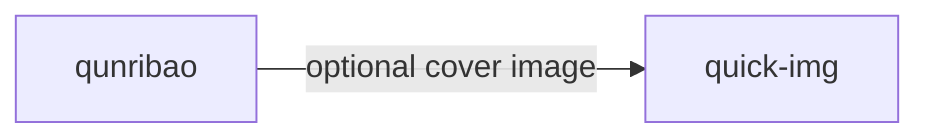

<p align="center">
  
  
  
</p>

<h1 align="center">my-skills</h1>

<p align="center"><b>Claude Code skills monorepo — extend Claude with domain-specific superpowers</b></p>

<p align="center">
  <b>English</b> | <a href="./README.zh.md">中文</a>
</p>

---

## TL;DR

**Problem:** Claude Code is powerful, but repetitive tasks (diagram generation, report writing, image creation, structured analysis) require manual prompting every time.

**Solution:** Installable skill packs that teach Claude domain-specific workflows — validated syntax, structured outputs, and multi-step automation built in.

| Skill | One-line | Runtime |
|-------|----------|---------|
| [mermaid-pro](./mermaid-pro/) | Mermaid diagrams with syntax validation + image export | Node.js |
| [systems-thinking](./systems-thinking/) | Structured systems thinking interviews with session persistence | None |
| [qunribao](./qunribao/) | WeChat group daily/weekly report generation from chat data | Python |
| [quick-img](./quick-img/) | Fast image generation via DMX API (Gemini Flash) | Python |

## Quick Start

```bash
# Install a single skill
npx skills add zenthos-z/my-skills/mermaid-pro

# Or install all skills
npx skills add zenthos-z/my-skills/mermaid-pro
npx skills add zenthos-z/my-skills/systems-thinking
npx skills add zenthos-z/my-skills/qunribao
npx skills add zenthos-z/my-skills/quick-img
```

After installation, skills activate automatically when you trigger their keywords in Claude Code (e.g., "generate a mermaid diagram", "systems thinking interview", "群日报").

## Skills Overview

### mermaid-pro

Professional Mermaid diagram generation with consistent styling.

- **9-color semantic palette** — color-coded by meaning (green=start, red=decision, blue=process)
- **Built-in syntax validation** — every diagram is parsed and verified before output
- **Batch image export** — convert all Mermaid blocks in a Markdown file to SVG/PNG
- **7 diagram types** — Flowchart, Sequence, Class, ERD, C4, State, Mindmap
- **3 style presets** — minimal, professional (default), colorful
- **Fully offline** — no external API calls, runs locally with Puppeteer

```bash
# Setup after install
cd ~/.claude/skills/mermaid-pro/scripts && npm install
```

See [mermaid-pro/README.md](./mermaid-pro/) for detailed configuration.

---

### systems-thinking

Structured systems thinking coach based on Dennis Sherwood's methodology.

- **5-stage interview protocol** — Claude guides you through problem boundary exploration, causal mapping, loop identification, diagram drawing, and leverage point discovery
- **Session persistence** — progress auto-saved at each stage, resume across conversations
- **15 thinking trap recognitions** — catches linear thinking, symptom fixing, ignoring time delays, and more
- **System loop diagram syntax** — text-based `[A] --S--> [B]` notation for causal links
- **Zero dependencies** — pure prompt engineering, no runtime needed

No setup required. Just invoke and start the interview.

---

### qunribao

WeChat group daily/weekly report generation system.

- **JSON-first architecture** — structured JSON → validated with JSON Schema → Markdown tables
- **Memory mechanism** — multi-version topic tracking with auto-cleanup (keeps last 10)
- **Describe mode** — Vision API analyzes chat images instead of unreliable file paths
- **Feishu Bitable upload** — direct JSON-to-Bitable payload construction
- **Privacy scanner** — pre-commit hook detecting group IDs, API keys, phone numbers
- **Graceful degradation** — works without optional `quick-img` dependency

```bash
# Requires Python 3.8+ and a running WeFlow instance (port 5031)
# First-time setup: run the init wizard in Claude Code
```

See [qunribao/README.md](./qunribao/) for WeFlow configuration and data pipeline details.

---

### quick-img

Fast image generation via DMX API (Gemini 3.1 Flash Image Preview).

- **3 usage modes** — Direct Prompt, Template (Markdown → infographic), Refine (condense → confirm → generate)
- **14 aspect ratios** — social media (4:5), presentations (16:9), mobile (9:16), and more
- **4 resolution tiers** — 0.5K quick preview to 4K print quality
- **Batch "gacha" mode** — same prompt, multiple distinct results via API randomness
- **SiYuan integration** — read SiYuan notes as image generation prompts
- **Template system** — custom `.txt` templates with `{{content}}` placeholder

```bash
# Requires Python 3.8+ and a DMX API key
# Set your key in assets/.env: DMX_API_KEY=sk-...
```

See [quick-img/README.md](./quick-img/) for API key setup and template customization.

## Cross-skill Dependencies



| Skill | Depends On | Required? |
|-------|-----------|-----------|
| qunribao | quick-img | No — gracefully degrades without it |

All other skills are fully independent.

## Installation

### Method 1: npx skills add (Recommended)

```bash
npx skills add zenthos-z/my-skills/<skill-name>
```

### Method 2: Manual copy

```bash
# Copy a single skill
cp -r mermaid-pro ~/.claude/skills/

# Copy all skills
cp -r mermaid-pro systems-thinking qunribao quick-img ~/.claude/skills/
```

### Method 3: Clone the repo

```bash
git clone https://github.com/zenthos-z/my-skills.git
# Then copy desired skills to ~/.claude/skills/
```

## Requirements Summary

| Skill | Runtime | External Services |
|-------|---------|-------------------|
| mermaid-pro | Node.js >= 18 | None (fully offline) |
| systems-thinking | None | None |
| qunribao | Python 3.8+ | WeFlow (local, port 5031) |
| quick-img | Python 3.8+ | DMX API (cloud) |

## Contributing

Contributions are welcome. Each skill is self-contained — feel free to add new skills or improve existing ones.

## License

All skills are released under the MIT License. See individual skill directories for details.
