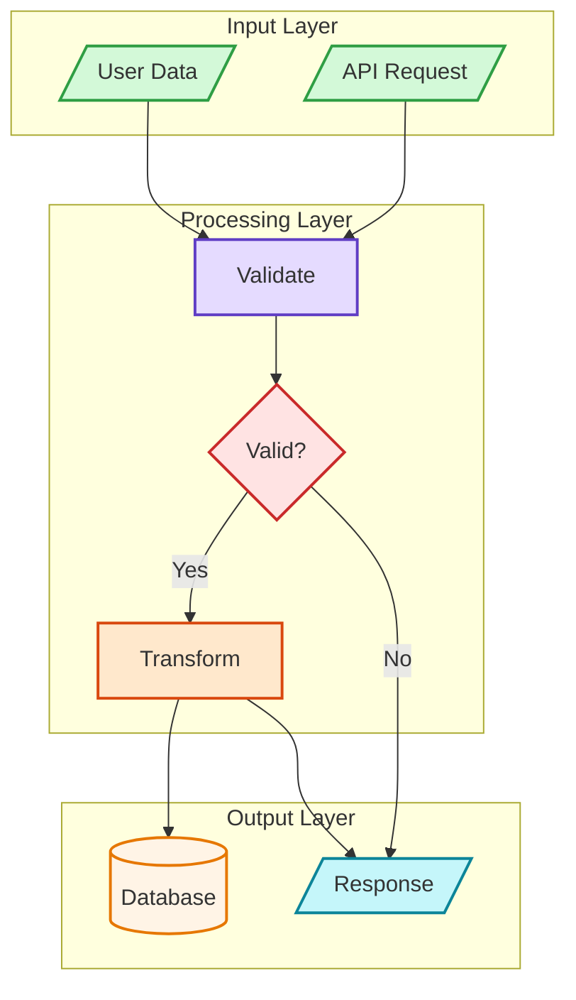

# mermaid-pro

[English](./README.md) | [中文](./README.zh.md)

A Claude Code skill for generating professional, visually appealing Mermaid diagrams with consistent styling, built-in syntax validation, and image export scripts.

## Features

- **7 diagram types**: Flowchart, Sequence, Class, ERD, C4, State, Mindmap
- **Semantic color palette** for consistent, professional output
- **3 style presets**: minimal, professional, colorful
- **Multiple layout engines**: dagre, elk, elk.stress, elk.force
- **Syntax validation script** — catch errors before rendering
- **MD → Image export script** — convert Mermaid blocks in Markdown files to SVG/PNG

## Installation

### One-click install (Recommended)

```bash
npx skills add zenthos-z/mermaid-pro
```

> Supports 40+ AI coding agents: Claude Code, Cursor, Codex, Cline, Roo Code, and more.
> See [skills CLI](https://github.com/vercel-labs/skills).

```bash
# Install to Claude Code only
npx skills add zenthos-z/mermaid-pro -a claude-code

# Global install (available in all projects)
npx skills add zenthos-z/mermaid-pro -g

# Install to multiple agents
npx skills add zenthos-z/mermaid-pro -a claude-code -a cursor -a codex
```

### Manual install

```bash
cp -r mermaid-pro ~/.claude/skills/
```

## Usage

Once installed, trigger the skill in Claude Code:

```
/mermaid-pro
```

Or just describe what you want to visualize — Claude will automatically use the skill when you ask for architecture diagrams, flowcharts, etc.

## Scripts

### Validate Mermaid Syntax

```bash
# Validate inline — exit 0 = valid, exit 1 = invalid (CI-friendly)
node scripts/validate-mermaid.mjs "flowchart TD
A --> B"

# Pipe mode (stdin)
echo "flowchart TD
A --> B" | node scripts/validate-mermaid.mjs -
```

Output: `{"valid":true}` or `{"valid":false,"error":"...","errorType":"..."}`

### Convert Markdown Mermaid Blocks to Images

Images are generated **next to the source `.md` file**. The script uses a local mermaid bundle and works fully offline.

```bash
# Preview what would be converted (no changes made)
node scripts/md-mermaid-to-image.mjs README.md --dry-run

# Export as SVG (default)
node scripts/md-mermaid-to-image.mjs ./docs --format svg

# Export as PNG
node scripts/md-mermaid-to-image.mjs README.md --format png

# Keep original code blocks alongside images
node scripts/md-mermaid-to-image.mjs README.md --keep-code
```

Exits with code 1 if any conversion fails — safe to use in CI pipelines.

**Install script dependencies first:**

```bash
cd scripts && npm install
```

## Diagram Types

| Type | Keyword | Best For |
|------|---------|----------|
| Flowchart | `flowchart TD/LR` | Processes, decisions, workflows |
| Sequence | `sequenceDiagram` | API flows, interactions |
| Class | `classDiagram` | OOP design |
| ERD | `erDiagram` | Database schemas |
| C4 | `C4Context` | Architecture |
| State | `stateDiagram-v2` | State machines |
| Mindmap | `mindmap` | Hierarchical concepts |

## Color Palette

Semantic colors for consistent diagrams:

| Color | Fill | Stroke | Usage |
|-------|------|--------|-------|
| Green | `#d3f9d8` | `#2f9e44` | Input, Start, Success |
| Red | `#ffe3e3` | `#c92a2a` | Decision, Error, Warning |
| Purple | `#e5dbff` | `#5f3dc4` | Process, Reasoning |
| Orange | `#ffe8cc` | `#d9480f` | Action, Tools |
| Cyan | `#c5f6fa` | `#0c8599` | Output, Results |
| Yellow | `#fff4e6` | `#e67700` | Storage, Data |
| Blue | `#e7f5ff` | `#1971c2` | Metadata, Titles |
| Gray | `#f8f9fa` | `#868e96` | Neutral, Legacy |
| Pink | `#f3d9fa` | `#862e9c` | Learning, Optimization |

## Example Output



## File Structure

```
mermaid-pro/
├── SKILL.md                    # Claude skill definition
├── scripts/
│   ├── validate-mermaid.mjs    # Syntax validator
│   ├── md-mermaid-to-image.mjs # MD → image exporter
│   └── package.json
└── references/
    ├── CHEATSHEET.md           # Syntax quick reference
    ├── ERROR-PREVENTION.md     # Common errors & fixes
    ├── layout.md               # Advanced layout engines
    └── diagrams/
        ├── flowcharts.md
        ├── sequence.md
        ├── class.md
        ├── erd.md
        ├── c4.md
        └── patterns.md
```

## License

MIT
