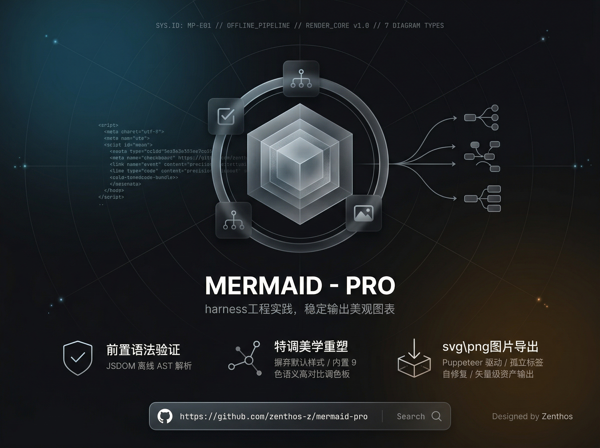
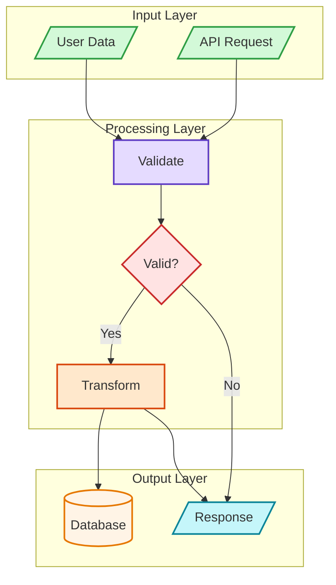

<p align="center">
  
</p>


<p align="center">
  <b>Professional Mermaid diagrams — consistent styling, built-in validation, one command export.</b>
</p>


<p align="center">
  <a href="https://github.com/vercel-labs/skills"></a>
  
  
</p>


<p align="center">
  <a href="./README.md">English</a> | <a href="./README.zh.md">中文</a>
</p>

---

## TL;DR

**Problem:** Mermaid diagrams in AI-generated output are inconsistent, poorly styled, and often contain syntax errors that silently break rendering.

**Solution:** Mermaid Pro gives your AI coding assistant a semantic color system, syntax validation pipeline, and image export tooling — so every diagram looks professional and renders correctly.

| Feature                            | Benefit                                             |
| ---------------------------------- | --------------------------------------------------- |
| 7 diagram types with templates     | Never start from scratch                            |
| Semantic color palette (9 colors)  | Consistent, professional visuals every time         |
| Built-in syntax validator          | Catch errors before rendering, CI-friendly          |
| MD → SVG/PNG export                | One command to convert all Mermaid blocks to images |
| 3 style presets + 4 layout engines | Match any documentation style                       |
| Works offline                      | No external API calls, fully local rendering        |

---

## Quick Start

```bash
# 1. Install the skill
npx skills add zenthos-z/mermaid-pro

# 2. Ask your AI assistant to create a diagram
# In Claude Code, just type:
/mermaid-pro

# 3. Or describe what you need — the skill auto-activates
# "Draw a microservice architecture with 3 services and a message queue"
```

That's it. Your AI assistant will now generate validated, color-coded Mermaid diagrams following the professional style guide.

---

## Installation

### One-click install (Recommended)

```bash
npx skills add zenthos-z/mermaid-pro
```

> Supports 40+ AI coding agents: Claude Code, Cursor, Codex, Cline, Roo Code, and more.
> See [skills CLI](https://github.com/vercel-labs/skills).

### Manual install

```bash
cp -r mermaid-pro ~/.claude/skills/
```

---

## Usage

Once installed, trigger the skill in Claude Code:

```
/mermaid-pro
```

Or just describe what you want to visualize — Claude will automatically use the skill when you ask for architecture diagrams, flowcharts, sequence diagrams, ERD, and more.

**Examples of prompts that activate the skill:**

- "Create a flowchart for the user registration process"

- "Draw a C4 architecture diagram for our microservices"

- "Generate an ERD for the order management database"

- "Visualize this state machine for order processing"

The skill follows a 6-step workflow: **Analyze → Select Type → Configure → Generate → Validate → Export**

Every diagram is syntax-validated before output, so you never get broken renderings.

---

## Diagram Types

| Type      | Keyword           | Best For                              |
| --------- | ----------------- | ------------------------------------- |
| Flowchart | `flowchart TD/LR` | Processes, decisions, workflows       |
| Sequence  | `sequenceDiagram` | API flows, service interactions       |
| Class     | `classDiagram`    | OOP design, type hierarchies          |
| ERD       | `erDiagram`       | Database schemas, data models         |
| C4        | `C4Context`       | System architecture, deployment views |
| State     | `stateDiagram-v2` | State machines, lifecycle diagrams    |
| Mindmap   | `mindmap`         | Hierarchical concepts, brainstorming  |

### Style Presets

| Style          | Description                                   |
| -------------- | --------------------------------------------- |
| `minimal`      | Monochrome, simple lines — for technical docs |
| `professional` | Semantic colors, clear hierarchy (default)    |
| `colorful`     | High contrast, vibrant — for presentations    |

### Layout Engines

| Engine     | Config               | Best For                         |
| ---------- | -------------------- | -------------------------------- |
| dagre      | (default)            | Simple hierarchical diagrams     |
| elk        | `layout: elk`        | Complex diagrams, better spacing |
| elk.stress | `layout: elk.stress` | Network graphs                   |
| elk.force  | `layout: elk.force`  | Force-directed layouts           |

---

## Color Palette

9 semantic colors designed for consistent, accessible diagrams:

| Color  | Fill      | Stroke    | Usage                    |
| ------ | --------- | --------- | ------------------------ |
| Green  | `#d3f9d8` | `#2f9e44` | Input, Start, Success    |
| Red    | `#ffe3e3` | `#c92a2a` | Decision, Error, Warning |
| Purple | `#e5dbff` | `#5f3dc4` | Process, Reasoning       |
| Orange | `#ffe8cc` | `#d9480f` | Action, Tools            |
| Cyan   | `#c5f6fa` | `#0c8599` | Output, Results          |
| Yellow | `#fff4e6` | `#e67700` | Storage, Data            |
| Blue   | `#e7f5ff` | `#1971c2` | Metadata, Titles         |
| Gray   | `#f8f9fa` | `#868e96` | Neutral, Legacy          |
| Pink   | `#f3d9fa` | `#862e9c` | Learning, Optimization   |

**Style syntax:** `style NodeID fill:#color,stroke:#color,stroke-width:2px`

---

## Example Output



---

## Scripts

### Validate Mermaid Syntax

Catch syntax errors before rendering — CI-friendly with proper exit codes.

```bash
# Inline validation — exit 0 = valid, exit 1 = invalid
node scripts/validate-mermaid.mjs "flowchart TD
A --> B"

# Pipe mode (stdin)
echo "flowchart TD
A --> B" | node scripts/validate-mermaid.mjs -
```

Output: `{"valid":true}` or `{"valid":false,"error":"...","errorType":"..."}`

### Convert Markdown Mermaid Blocks to Images

Batch export all Mermaid code blocks in your Markdown files to SVG or PNG. Works fully offline.

```bash
# Preview what would be converted (no changes made)
node scripts/md-mermaid-to-image.mjs README.md --dry-run

# Export as SVG (default)
node scripts/md-mermaid-to-image.mjs ./docs --format svg

# Export as PNG
node scripts/md-mermaid-to-image.mjs README.md --format png

# Keep original code blocks alongside images
node scripts/md-mermaid-to-image.mjs README.md --keep-code
```

Exits with code 1 if any conversion fails — safe to use in CI pipelines.

**Install script dependencies first:**

```bash
cd scripts && npm install
```

---

## File Structure

```
mermaid-pro/
├── SKILL.md                    # Claude skill definition
├── scripts/
│   ├── validate-mermaid.mjs    # Syntax validator
│   ├── md-mermaid-to-image.mjs # MD → image exporter
│   └── package.json
└── references/
    ├── CHEATSHEET.md           # Syntax quick reference
    ├── ERROR-PREVENTION.md     # Common errors & fixes
    ├── layout.md               # Advanced layout engines
    └── diagrams/
        ├── flowcharts.md
        ├── sequence.md
        ├── class.md
        ├── erd.md
        ├── c4.md
        └── patterns.md
```

---

## License

MIT