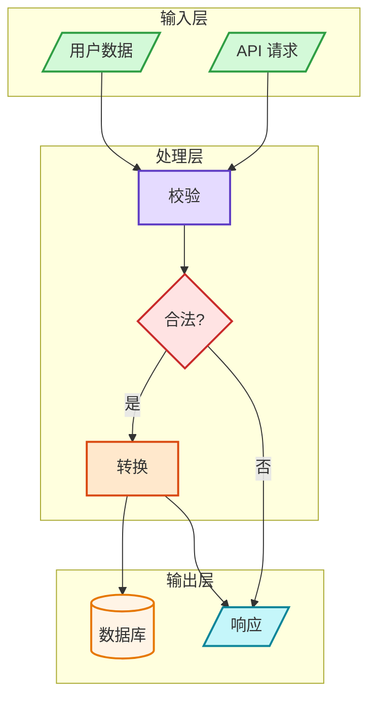

# mermaid-pro

[English](./README.md) | [中文](./README.zh.md)

用于生成专业 Mermaid 图表的 Claude Code 技能，内置语义色彩规范、语法校验和 Markdown 转图片脚本。

## 功能特性

- **7 种图表类型**：流程图、时序图、类图、ERD、C4、状态机、思维导图
- **语义色彩规范**，风格统一、输出专业
- **3 种样式预设**：minimal（极简）、professional（专业）、colorful（彩色）
- **多种布局引擎**：dagre、elk、elk.stress、elk.force
- **语法校验脚本** — 渲染前提前发现错误
- **MD → 图片导出脚本** — 将 Markdown 中的 Mermaid 代码块批量导出为 SVG/PNG

## 安装

```bash
claude skill install https://github.com/lz347396004/mermaid-pro
```

或手动复制到 Claude 技能目录：

```bash
cp -r mermaid-pro ~/.claude/skills/
```

## 使用方式

安装后，在 Claude Code 中触发技能：

```
/mermaid-pro
```

或直接描述你想可视化的内容 — 当你请求架构图、流程图等时，Claude 会自动调用本技能。

## 脚本工具

### 校验 Mermaid 语法

```bash
node scripts/validate-mermaid.mjs "flowchart TD\n A --> B"
```

### 将 Markdown 中的 Mermaid 代码块导出为图片

```bash
# 导出为 SVG（默认）
node scripts/md-mermaid-to-image.mjs ./docs --format svg

# 导出为 PNG
node scripts/md-mermaid-to-image.mjs README.md --format png

# 保留原始代码块，同时附加图片
node scripts/md-mermaid-to-image.mjs README.md --keep-code
```

**首次使用前安装依赖：**

```bash
cd scripts && npm install
```

## 图表类型

| 类型 | 关键词 | 适用场景 |
|------|--------|----------|
| 流程图 | `flowchart TD/LR` | 流程、决策、工作流 |
| 时序图 | `sequenceDiagram` | API 调用、交互流程 |
| 类图 | `classDiagram` | 面向对象设计 |
| ERD | `erDiagram` | 数据库结构 |
| C4 架构图 | `C4Context` | 系统架构 |
| 状态机 | `stateDiagram-v2` | 状态流转 |
| 思维导图 | `mindmap` | 层级概念 |

## 色彩规范

| 颜色 | 填充色 | 描边色 | 语义用途 |
|------|--------|--------|----------|
| 绿色 | `#d3f9d8` | `#2f9e44` | 输入、开始、成功 |
| 红色 | `#ffe3e3` | `#c92a2a` | 决策、错误、警告 |
| 紫色 | `#e5dbff` | `#5f3dc4` | 处理、推理 |
| 橙色 | `#ffe8cc` | `#d9480f` | 动作、工具 |
| 青色 | `#c5f6fa` | `#0c8599` | 输出、结果 |
| 黄色 | `#fff4e6` | `#e67700` | 存储、数据 |
| 蓝色 | `#e7f5ff` | `#1971c2` | 元数据、标题 |
| 灰色 | `#f8f9fa` | `#868e96` | 中性、遗留 |
| 粉色 | `#f3d9fa` | `#862e9c` | 学习、优化 |

## 示例输出



## 目录结构

```
mermaid-pro/
├── README.md                   ← 英文文档
├── README.zh.md                ← 中文文档
├── LICENSE                     ← MIT 许可证
├── SKILL.md                    ← Claude 技能定义
├── scripts/
│   ├── validate-mermaid.mjs    ← 语法校验
│   ├── md-mermaid-to-image.mjs ← MD 转图片
│   └── package.json
└── references/
    ├── CHEATSHEET.md           ← 语法速查表
    ├── ERROR-PREVENTION.md     ← 常见错误与修复
    ├── layout.md               ← 高级布局引擎配置
    └── diagrams/
        ├── flowcharts.md
        ├── sequence.md
        ├── class.md
        ├── erd.md
        ├── c4.md
        └── patterns.md
```

## 许可证

MIT
