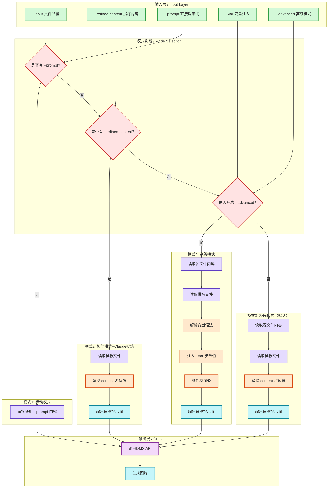

# DMX Image Generator - 提示词组装机制详解

## 概述

DMX Image Generator 支持**四种工作模式**，每种模式有不同的提示词组装流程。本文档详细说明最终提示词是如何生成的。

---

## 提示词组装流程图



---

## 四种工作模式详解

### 模式1: 手动模式 (Manual Mode)

**触发条件**: 使用 `--prompt` 参数

**命令示例**:
```bash
python scripts/generate_image.py --prompt "AI概念图" --ratio 16:9 --size 2K
```

**提示词组装过程**:
```
最终提示词 = --prompt 参数值
```

**说明**: 直接使用用户输入的提示词，不经过任何模板处理。

---

### 模式2: 极简模式 + Claude提炼 (Simple Mode + Refined)

**触发条件**: 使用 `--input` + `--refined-content` 参数

**命令示例**:
```bash
python scripts/generate_image.py \
  --input report.md \
  --refined-content "【日期】2026-03-24..." \
  --ratio 4:5 --size 2K
```

**提示词组装过程**:

1. **读取模板文件** (`assets/templates/daily_infographic.txt`):
```
内容如下：
{{content}}

根据以上内容，生成一图胜千言的图片：
要求：信息图表风格，逻辑清晰，数据可视化...
```

2. **替换占位符**: 将 `{{content}}` 替换为 `--refined-content` 参数值

3. **最终提示词**:
```
内容如下：
【日期】2026-03-24...
（Claude提炼后的结构化内容）

根据以上内容，生成一图胜千言的图片：
要求：信息图表风格，逻辑清晰，数据可视化...
```

**说明**: 这是**推荐模式**，Claude 先提炼原文精华，再传入生成，效果最好。

---

### 模式3: 极简模式（默认）(Simple Mode)

**触发条件**: 仅使用 `--input` 参数（默认）

**命令示例**:
```bash
python scripts/generate_image.py --input report.md --ratio 4:5
```

**提示词组装过程**:

1. **读取源文件内容** (`report.md`):
```markdown
# 日报：正式群｜GAiR 实战局...
**日期**：2026-03-24
...
```

2. **读取模板文件** (`assets/templates/default.txt`):
```
内容如下：
{{content}}

根据以上内容，生成一图胜千言的图片：
...
```

3. **替换占位符**: 将 `{{content}}` 替换为源文件完整内容

4. **最终提示词**:
```
内容如下：
# 日报：正式群｜GAiR 实战局...
**日期**：2026-03-24
...（完整原文）

根据以上内容，生成一图胜千言的图片：
...
```

**说明**: 直接将原文拼接到模板，简单直接，但可能因内容过长导致效果不佳。

---

### 模式4: 高级模式 (Advanced Mode)

**触发条件**: 使用 `--input` + `--advanced` + `--var` 参数

**命令示例**:
```bash
python scripts/generate_image.py \
  --input report.md \
  --advanced \
  --var date="2026-03-24" \
  --var summary="讨论AI记忆机制" \
  --var topics="Memento-Skills, Token优化" \
  --template daily_report
```

**支持的模板语法**:

| 语法 | 说明 | 示例 |
|------|------|------|
| `{{var}}` | 变量替换 | `{{date}}` → `2026-03-24` |
| `{{var\|default}}` | 带默认值的变量 | `{{date\|今日}}` |
| `{{#var}}...{{/var}}` | 条件块 | `{{#members}}活跃成员: {{members}}{{/members}}` |

**提示词组装过程**:

1. **读取源文件内容**（限制2000字）
2. **读取模板文件**
3. **解析模板语法**:
   - 识别所有 `{{var}}` 变量占位符
   - 识别所有 `{{#var}}...{{/var}}` 条件块
4. **注入变量值**:
   - `--var date="2026-03-24"` → `{{date}}` 被替换
   - `--var summary="xxx"` → `{{summary}}` 被替换
5. **条件块渲染**:
   - 如果 `active_members` 有值，保留块内内容
   - 如果为空，整个条件块被移除
6. **输出最终提示词**

**说明**: 适合需要精细控制输出格式的场景，使用变量注入实现模板化。

---

## 决策优先级

当多个参数同时存在时，系统按以下优先级选择模式：

```
--prompt 存在?
  ├─ 是 → 手动模式
  └─ 否 → --refined-content 存在?
            ├─ 是 → 极简+提炼模式
            └─ 否 → --advanced 开启?
                      ├─ 是 → 高级模式
                      └─ 否 → 极简模式（默认）
```

---

## 最佳实践

| 场景 | 推荐模式 | 原因 |
|------|----------|------|
| 快速测试 | 手动模式 | 无需准备文件，直接输入提示词 |
| 日报生成（推荐） | 极简+提炼 | Claude 先提炼精华，生成效果更好 |
| 批量文档 | 极简模式 | 简单直接，无需额外处理 |
| 精细控制 | 高级模式 | 使用变量注入，格式可控 |
