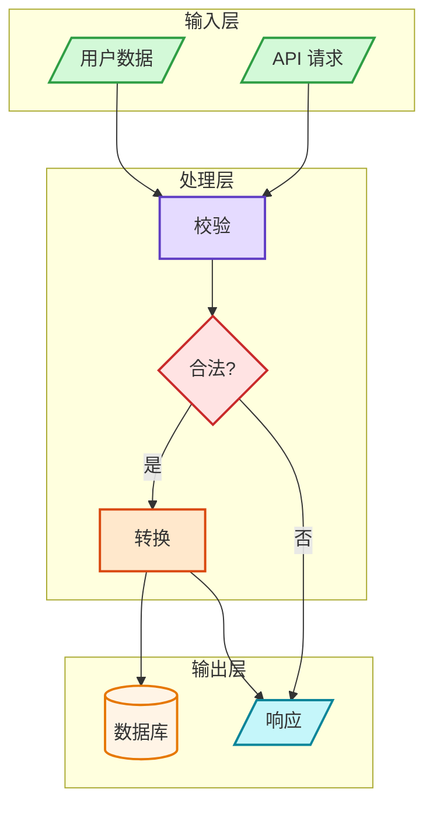

<p align="center">
  
</p>


<p align="center">
  <b>专业 Mermaid 图表 — 统一样式、内置校验、一键导出。</b>
</p>


<p align="center">
  <a href="https://github.com/vercel-labs/skills"></a>
  
  
</p>


<p align="center">
  <a href="./README.md">English</a> | <a href="./README.zh.md">中文</a>
</p>

---

## TL;DR

**问题：** AI 生成的 Mermaid 图表风格混乱、配色不统一，且经常包含语法错误导致渲染失败。

**方案：** Mermaid Pro 为 AI 编程助手提供语义色彩系统、语法校验管线和图片导出工具 — 让每张图表都专业、准确。

| 特性                | 优势                     |
| ----------------- | ---------------------- |
| 7 种图表类型 + 模板      | 无需从零开始                 |
| 语义色彩规范（9 种颜色）     | 每次输出风格统一、专业            |
| 内置语法校验器           | 渲染前发现错误，CI 友好          |
| MD → SVG/PNG 导出   | 一条命令批量转换所有 Mermaid 代码块 |
| 3 种样式预设 + 4 种布局引擎 | 适配任何文档风格               |
| 完全离线工作            | 无外部 API 调用，本地渲染        |

---

## 快速开始

```bash
# 1. 安装技能
npx skills add zenthos-z/mermaid-pro

# 2. 让 AI 助手创建图表
# 在 Claude Code 中输入：
/mermaid-pro

# 3. 或直接描述需求 — 技能会自动激活
# "画一个包含 3 个微服务和消息队列的架构图"
```

AI 助手会自动按照专业样式规范生成经过校验的 Mermaid 图表。

---

## 安装

### 一键安装（推荐）

```bash
npx skills add zenthos-z/mermaid-pro
```

> 支持所有主流 AI 编程助手：Claude Code、Cursor、Codex、Cline、Roo Code 等 40+ 客户端。
> 详见 [skills CLI](https://github.com/vercel-labs/skills)。

### 手动安装

```bash
# 从 monorepo 克隆（推荐）
git clone https://github.com/zenthos-z/my-skills.git
cp -r my-skills/mermaid-pro ~/.claude/skills/
```

---

## 使用方式

安装后，在 Claude Code 中触发技能：

```
/mermaid-pro
```

或直接描述你想可视化的内容 — 当你请求架构图、流程图、时序图、ERD 等时，Claude 会自动调用本技能。

**可激活技能的提示词示例：**

- "创建一个用户注册流程的流程图"

- "画一个微服务的 C4 架构图"

- "生成订单管理数据库的 ERD"

- "可视化订单处理的状态机"

技能遵循 6 步工作流：**分析 → 选择类型 → 配置 → 生成 → 校验 → 导出**

每张图表在输出前都会经过语法校验，杜绝渲染失败。

---

## 图表类型

| 类型     | 关键词               | 适用场景        |
| ------ | ----------------- | ----------- |
| 流程图    | `flowchart TD/LR` | 流程、决策、工作流   |
| 时序图    | `sequenceDiagram` | API 调用、服务交互 |
| 类图     | `classDiagram`    | 面向对象设计、类型层次 |
| ERD    | `erDiagram`       | 数据库结构、数据模型  |
| C4 架构图 | `C4Context`       | 系统架构、部署视图   |
| 状态机    | `stateDiagram-v2` | 状态流转、生命周期   |
| 思维导图   | `mindmap`         | 层级概念、头脑风暴   |

### 样式预设

| 样式             | 说明               |
| -------------- | ---------------- |
| `minimal`      | 单色、简洁线条 — 适合技术文档 |
| `professional` | 语义色彩、清晰层次（默认）    |
| `colorful`     | 高对比度、鲜艳色彩 — 适合演示 |

### 布局引擎

| 引擎         | 配置                   | 适用场景      |
| ---------- | -------------------- | --------- |
| dagre      | （默认）                 | 简单层次图     |
| elk        | `layout: elk`        | 复杂图表、更优间距 |
| elk.stress | `layout: elk.stress` | 网络图       |
| elk.force  | `layout: elk.force`  | 力导向布局     |

---

## 色彩规范

9 种语义色彩，确保图表一致且易读：

| 颜色  | 填充色       | 描边色       | 语义用途     |
| --- | --------- | --------- | -------- |
| 绿色  | `#d3f9d8` | `#2f9e44` | 输入、开始、成功 |
| 红色  | `#ffe3e3` | `#c92a2a` | 决策、错误、警告 |
| 紫色  | `#e5dbff` | `#5f3dc4` | 处理、推理    |
| 橙色  | `#ffe8cc` | `#d9480f` | 动作、工具    |
| 青色  | `#c5f6fa` | `#0c8599` | 输出、结果    |
| 黄色  | `#fff4e6` | `#e67700` | 存储、数据    |
| 蓝色  | `#e7f5ff` | `#1971c2` | 元数据、标题   |
| 灰色  | `#f8f9fa` | `#868e96` | 中性、遗留    |
| 粉色  | `#f3d9fa` | `#862e9c` | 学习、优化    |

**样式语法：** `style NodeID fill:#color,stroke:#color,stroke-width:2px`

---

## 示例输出



---

## 脚本工具

### 校验 Mermaid 语法

渲染前发现语法错误 — 支持正确的退出码，CI 友好。

```bash
# 内联校验 — 退出码 0 = 合法，退出码 1 = 非法
node scripts/validate-mermaid.mjs "flowchart TD
A --> B"

# 管道模式（stdin）
echo "flowchart TD
A --> B" | node scripts/validate-mermaid.mjs -
```

输出：`{"valid":true}` 或 `{"valid":false,"error":"...","errorType":"..."}`

### 将 Markdown 中的 Mermaid 代码块导出为图片

批量将 Markdown 文件中的 Mermaid 代码块导出为 SVG 或 PNG。完全支持离线环境。

```bash
# 预览将要转换的内容（不做任何修改）
node scripts/md-mermaid-to-image.mjs README.md --dry-run

# 导出为 SVG（默认）
node scripts/md-mermaid-to-image.mjs ./docs --format svg

# 导出为 PNG
node scripts/md-mermaid-to-image.mjs README.md --format png

# 保留原始代码块，同时附加图片
node scripts/md-mermaid-to-image.mjs README.md --keep-code
```

任意转换失败时以退出码 1 结束，可安全用于 CI 流水线。

**首次使用前安装依赖：**

```bash
cd scripts && npm install
```

---

## 目录结构

```
mermaid-pro/
├── README.md                   ← 英文文档
├── README.zh.md                ← 中文文档
├── SKILL.md                    ← Claude 技能定义
├── scripts/
│   ├── validate-mermaid.mjs    ← 语法校验
│   ├── md-mermaid-to-image.mjs ← MD 转图片
│   └── package.json
└── references/
    ├── CHEATSHEET.md           ← 语法速查表
    ├── ERROR-PREVENTION.md     ← 常见错误与修复
    ├── layout.md               ← 高级布局引擎配置
    └── diagrams/
        ├── flowcharts.md
        ├── sequence.md
        ├── class.md
        ├── erd.md
        ├── c4.md
        └── patterns.md
```

---

## 许可证

MIT