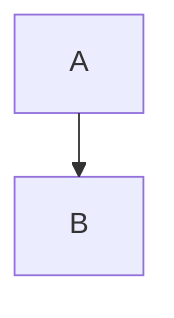
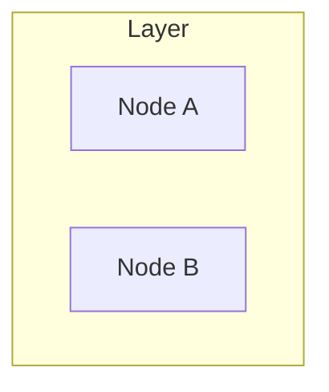
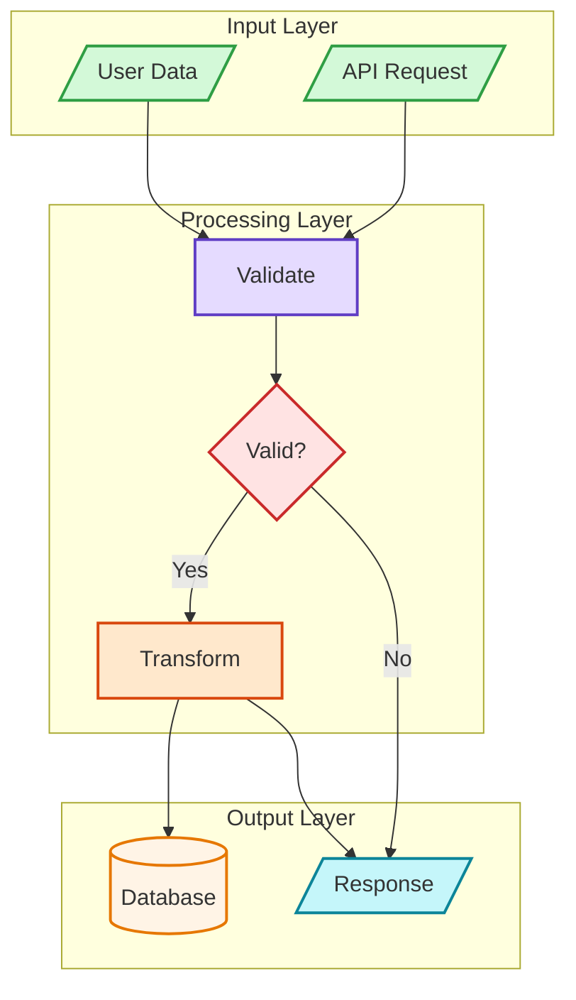
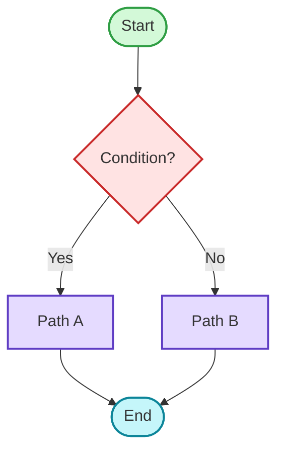
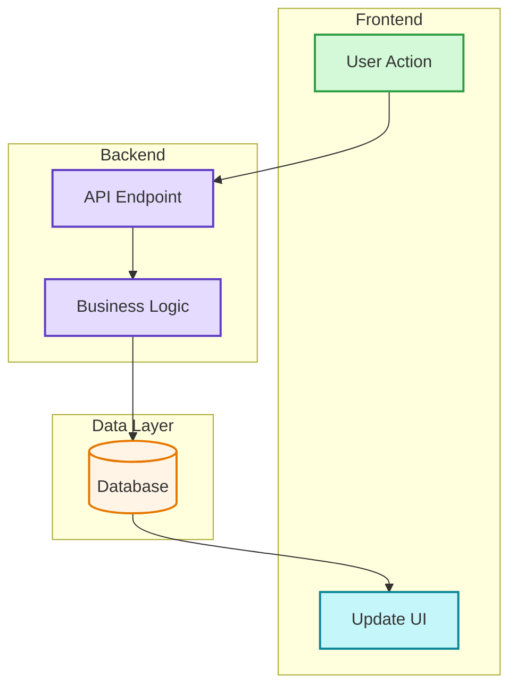
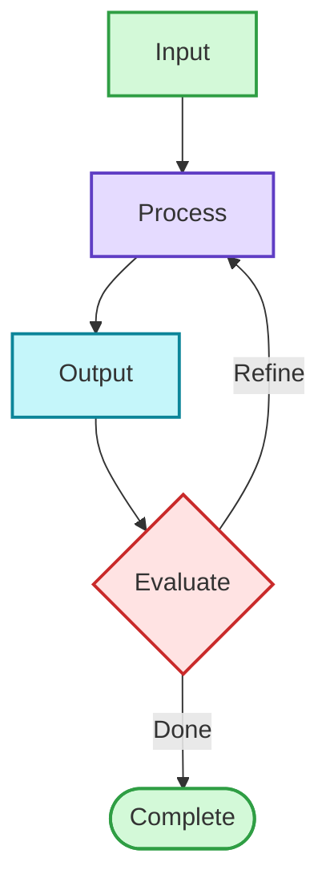

# Mermaid Pro

Generate professional, visually appealing Mermaid diagrams with consistent styling.

## Initialization (First Run)

On first invocation in a new session, check environment readiness before proceeding.

### Step 0: Environment Check

```bash
node scripts/setup.mjs
```

- `{"ready":true,"features":{"validate":true,"export":true}}` → proceed to Workflow
- `{"ready":true,"features":{"validate":true,"export":false}}` → validation works, image export unavailable (puppeteer/Chrome issue)
- `{"ready":false}` → script auto-installs dependencies; if still failing, run manually: `cd scripts && npm install`

**Node.js >= 18 required.**

| Package | Purpose | Feature |
|---------|---------|---------|
| jsdom | Server-side DOM for mermaid parsing | Validation |
| mermaid | Diagram syntax engine | Validation |
| puppeteer | Headless Chrome rendering | Image Export (SVG/PNG) |

### Skill Capabilities

On first use, briefly inform the user:
- **7 diagram types**: Flowchart, Sequence, Class, ERD, C4, State, Mindmap
- **9-color semantic palette**: consistent professional styling (see Color Palette below)
- **Built-in syntax validation**: catches errors before output
- **Batch image export**: convert mermaid blocks in markdown to SVG/PNG

## Workflow

1. **Analyze** → Understand the concept to visualize
2. **Select Type** → Choose diagram type (see table below)
3. **Configure** → Set layout, detail level, and style
4. **Generate** → Create syntax-safe code following Output Template
5. **Validate** → Run syntax validation (REQUIRED before output)
6. **Export** → Write to document or render to SVG/PNG

> **Tip:** If this is the first use, run `node scripts/setup.mjs` to verify the environment (Step 0).

### Step 5: Validate (REQUIRED)

**Before** writing to any file or generating images, you MUST validate the syntax:

```bash
node scripts/validate-mermaid.mjs "你的Mermaid代码"
```

- If `{"valid":true}` → proceed to export
- If `{"valid":false}` → fix the error, then re-validate

**Common validation errors:**
| Error Type | Fix |
|------------|-----|
| `markdown_conflict` | Remove space after number: `1.Text` instead of `1. Text` |
| `curly_brace_in_text` | Wrap in quotes: `A["path/{name}/"]` or remove `{}` |
| `undefined_reference` | Check node IDs match between definition and reference |
| `parse_error` | Check subgraph syntax, arrows, special characters |

## Diagram Types

| Type | Keyword | Best For |
|------|---------|----------|
| Flowchart | `flowchart TD/LR` | Processes, decisions, workflows |
| Sequence | `sequenceDiagram` | API flows, interactions |
| Class | `classDiagram` | OOP design |
| ERD | `erDiagram` | Database schemas |
| C4 | `C4Context` | Architecture |
| State | `stateDiagram-v2` | State machines |
| Mindmap | `mindmap` | Hierarchical concepts |

## Output Configuration

### Layout Direction

| Direction | Use Case |
|-----------|----------|
| `TD` or `TB` | Vertical flow (default) |
| `LR` | Horizontal flow, timelines |
| `BT` | Bottom-up, growth charts |
| `RL` | Right-to-left |

### Detail Level

| Level | Description |
|-------|-------------|
| `simple` | Core nodes only, minimal labels |
| `standard` | Key descriptions (default) |
| `detailed` | Full annotations and notes |

### Style Preset

| Style | Description |
|-------|-------------|
| `minimal` | Monochrome, simple lines |
| `professional` | Semantic colors, clear hierarchy (default) |
| `colorful` | High contrast, vibrant |

### Layout Engine

Control rendering engine via YAML frontmatter:

| Engine | Config | Best For |
|--------|--------|----------|
| dagre | (default) | Simple hierarchical diagrams |
| elk | `layout: elk` | Complex diagrams, better spacing |
| elk.stress | `layout: elk.stress` | Network graphs |
| elk.force | `layout: elk.force` | Force-directed layouts |

**Example:**


**For advanced options (mergeEdges, nodePlacementStrategy), see [layout.md](references/layout.md)**

### Subgraph Direction

Control internal layout independently per subgraph:



**Common patterns:**
- Vertical main + horizontal subgroups: `flowchart TB` + `direction LR`
- Timeline with details: `flowchart LR` + `direction TB`

## Color Palette

Semantic colors for consistent, professional diagrams:

| Color | Fill | Stroke | Usage |
|-------|------|--------|-------|
| Green | `#d3f9d8` | `#2f9e44` | Input, Start, Success |
| Red | `#ffe3e3` | `#c92a2a` | Decision, Error, Warning |
| Purple | `#e5dbff` | `#5f3dc4` | Process, Reasoning |
| Orange | `#ffe8cc` | `#d9480f` | Action, Tools |
| Cyan | `#c5f6fa` | `#0c8599` | Output, Results |
| Yellow | `#fff4e6` | `#e67700` | Storage, Data |
| Blue | `#e7f5ff` | `#1971c2` | Metadata, Titles |
| Gray | `#f8f9fa` | `#868e96` | Neutral, Legacy |
| Pink | `#f3d9fa` | `#862e9c` | Learning, Optimization |

**Style syntax:** `style NodeID fill:#color,stroke:#color,stroke-width:2px`

## Output Template

Every diagram should follow this structure:

```
flowchart TD
    %% 1. Direction declaration

    %% 2. Node definitions (with styling)
    Start([Start])
    Process[Process]

    %% 3. Connections
    Start --> Process

    %% 4. Style declarations (REQUIRED for professional output)
    style Start fill:#d3f9d8,stroke:#2f9e44,stroke-width:2px
    style Process fill:#e5dbff,stroke:#5f3dc4,stroke-width:2px
```

**After generating, ALWAYS validate before saving:**
```bash
node scripts/validate-mermaid.mjs "flowchart TD\n  Start --> Process"
```

## Complete Example

A fully styled professional diagram:



## Quality Checklist (Pre-Export Validation)

Run this checklist **after Generate, before Export**:

- [ ] Run `validate-mermaid.mjs` → returns `{"valid":true}`
- [ ] No `1. ` pattern in node text (use `①`, `(1)`, or `Step 1:`)
- [ ] No unescaped curly braces `{` `}` in node text (use quotes `"text"` or remove them)
- [ ] Subgraphs with spaces use `id["Name"]` format
- [ ] All node references use IDs, not display names
- [ ] Direction explicitly set (`TD`, `LR`, etc.)
- [ ] All nodes have style declarations
- [ ] Valid arrow syntax (`-->`, `-.->`, `==>`)
- [ ] Consistent color usage per semantic meaning

## Common Patterns

### Decision Tree



### Swimlane Pattern



### Feedback Loop



## Scripts

### Validate Syntax
```bash
node scripts/validate-mermaid.mjs "flowchart TD\n A --> B"
```

### Convert MD Mermaid to Images
```bash
node scripts/md-mermaid-to-image.mjs ./docs --format svg
node scripts/md-mermaid-to-image.mjs README.md --keep-code
```

## References

Load these for detailed information when needed:

- **[layout.md](references/layout.md)** - Advanced layout engines and configuration
- **[ERROR-PREVENTION.md](references/ERROR-PREVENTION.md)** - Detailed error troubleshooting
- **[CHEATSHEET.md](references/CHEATSHEET.md)** - Complete syntax quick reference
- **[diagrams/flowcharts.md](references/diagrams/flowcharts.md)** - Flowchart patterns
- **[diagrams/sequence.md](references/diagrams/sequence.md)** - Sequence diagram guide
- **[diagrams/class.md](references/diagrams/class.md)** - Class diagram guide
- **[diagrams/erd.md](references/diagrams/erd.md)** - ERD schema guide
- **[diagrams/c4.md](references/diagrams/c4.md)** - C4 architecture guide
- **[diagrams/patterns.md](references/diagrams/patterns.md)** - More reusable patterns
