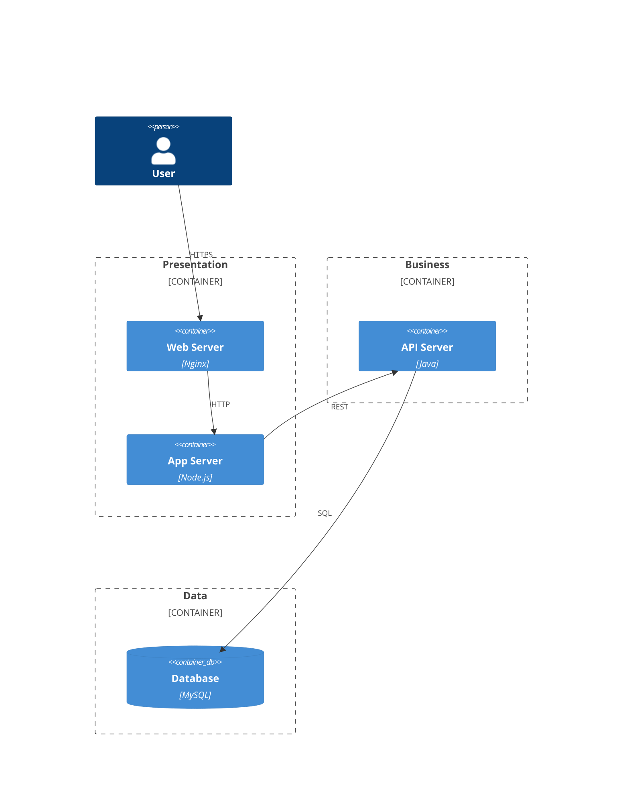
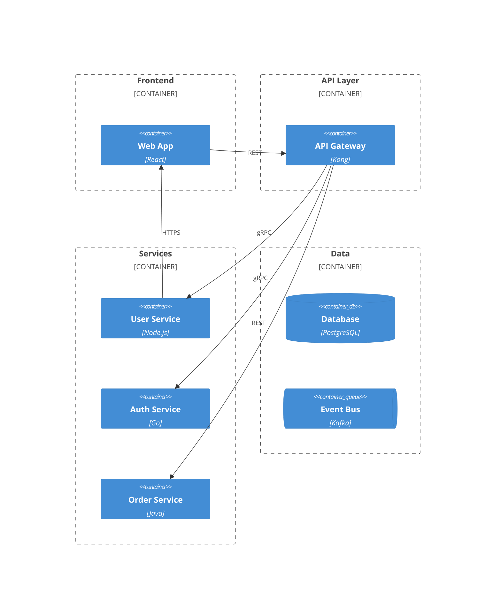
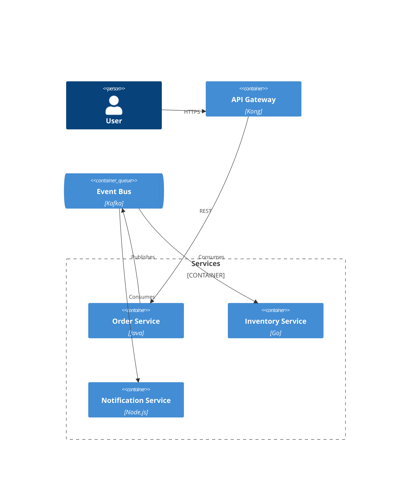

# C4 Architecture Diagrams Reference

The C4 model provides hierarchical architecture visualization: Context, Containers, Components, Code.

## C4 Model Levels

1. **System Context** - System and users/external systems
2. **Container** - Applications, databases, services
3. **Component** - Internal container structure
4. **Code** - Class diagrams (use class diagrams)

## C4 Context Diagram

Shows the big picture: system, users, external systems.

```
C4Context
    title System Context

    Person(customer, "Customer", "Description")
    System(app, "Application", "Description")
    System_Ext(external, "External", "Description")

    Rel(customer, app, "Uses")
    Rel(app, external, "Calls")
```

### Elements

**People:**
- `Person(id, "Name", "Description")`
- `Person_Ext(id, "Name", "Description")` - External

**Systems:**
- `System(id, "Name", "Description")`
- `System_Ext(id, "Name", "Description")` - External
- `SystemDb(id, "Name", "Description")` - Database
- `SystemQueue(id, "Name", "Description")` - Queue

**Relationships:**
- `Rel(from, to, "Label")`
- `Rel(from, to, "Label", "Technology")`
- `BiRel(a, b, "Bidirectional")`

## C4 Container Diagram

Shows applications, databases, services within the system.

```
C4Container
    title Container Diagram

    Container_Boundary(system, "System Name") {
        Container(web, "Web App", "React", "Description")
        Container(api, "API", "Node.js", "Description")
        ContainerDb(db, "Database", "PostgreSQL", "Description")
    }

    Rel(customer, web, "Uses", "HTTPS")
    Rel(web, api, "Calls", "JSON")
    Rel(api, db, "Queries", "SQL")
```

### Container Elements

- `Container(id, "Name", "Tech", "Description")`
- `ContainerDb(id, "Name", "Tech", "Description")`
- `ContainerQueue(id, "Name", "Tech", "Description")`
- `Container_Ext(id, "Name", "Tech", "Description")`

## C4 Component Diagram

Shows internal structure of a container.

```
C4Component
    title Component Diagram

    Container_Boundary(container, "Container Name") {
        Component(ctrl, "Controller", "Tech", "Description")
        Component(svc, "Service", "Tech", "Description")
        Component(repo, "Repository", "Tech", "Description")
    }

    Rel(ctrl, svc, "Uses")
    Rel(svc, repo, "Uses")
```

### Component Elements

- `Component(id, "Name", "Tech", "Description")`

## Common Patterns

### Three-Tier Architecture



### Microservices



### Event-Driven



## Best Practices

1. **Use appropriate level** - Context for stakeholders, Container for architects
2. **One system per diagram** - Keep focused
3. **Show key relationships** - Don't clutter
4. **Consistent naming** - Same names across levels
5. **Add technology details** - Frameworks, protocols
6. **Use boundaries** - Group related elements
7. **Document protocols** - REST, gRPC, messaging
8. **Mark external systems** - Use *_Ext variants
9. **Start simple** - Begin with Context, drill down
10. **Update regularly** - Keep in sync with architecture
