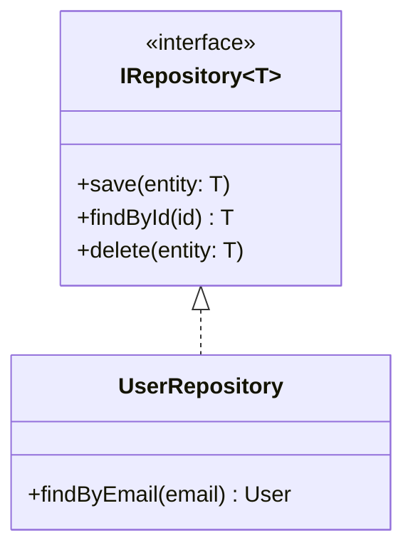
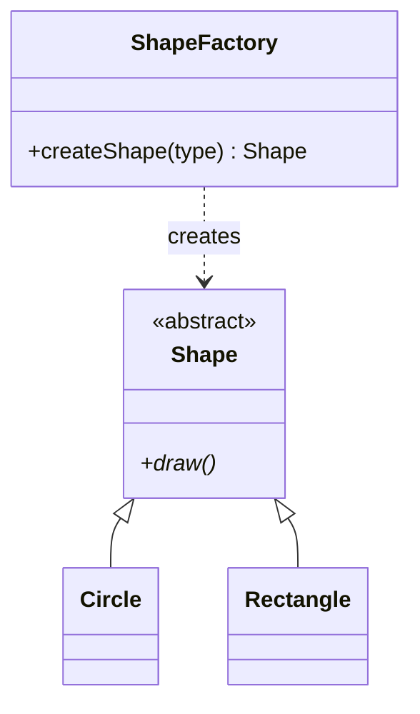
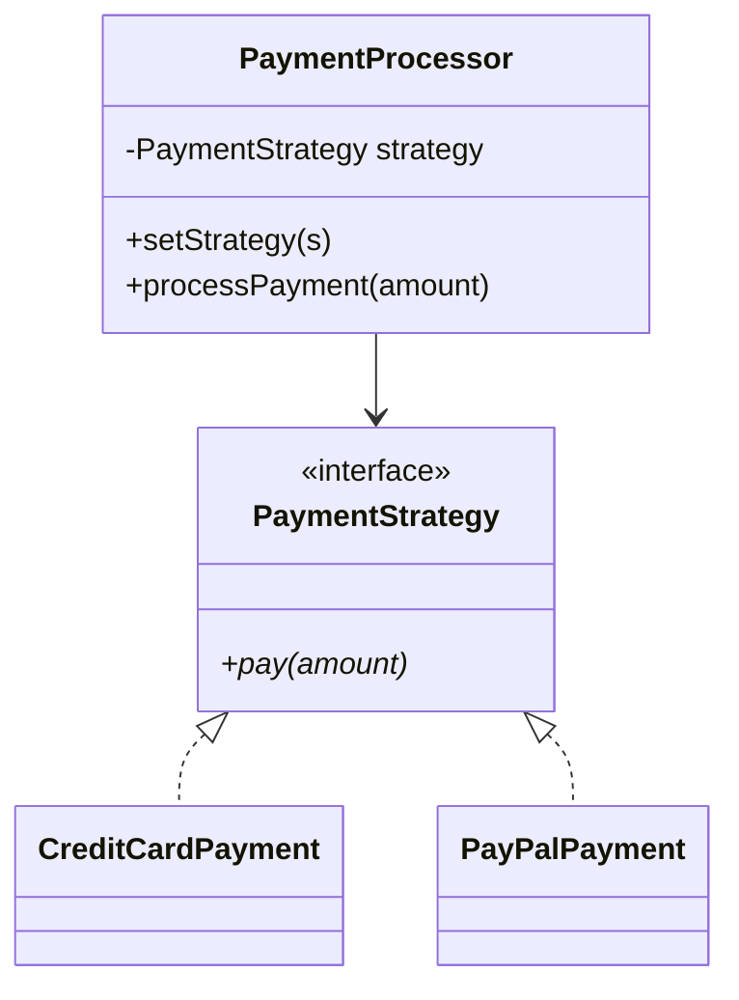

# Class Diagrams Reference

Class diagrams model object-oriented designs and domain models. Show entities, attributes/methods, and relationships.

## Basic Syntax

```
classDiagram
    ClassName
```

## Class Definition

```
classDiagram
    class BankAccount {
        +String owner
        +Decimal balance
        -String accountNumber
        +deposit(amount)
        +withdraw(amount) bool
    }
```

**Visibility:**
- `+` Public
- `-` Private
- `#` Protected
- `~` Package/Internal

## Relationships

| Type | Syntax | Meaning |
|------|--------|---------|
| Association | `A -- B` | Uses each other |
| Composition | `A *-- B` | Strong ownership (child deleted with parent) |
| Aggregation | `A o-- B` | Weak ownership (child can exist alone) |
| Inheritance | `A <\|-- B` | Is-a relationship |
| Dependency | `A <.. B` | Depends on (parameter, local var) |
| Implementation | `A <\|.. B` | Implements interface |

## Multiplicity

```
Customer "1" --> "0..*" Order : places
Order "1" *-- "1..*" LineItem : contains
```

**Common values:** `1`, `0..1`, `0..*`, `1..*`, `m..n`

## Stereotypes

```
class IRepository {
    <<interface>>
    +save(entity)
}

class UserService {
    <<service>>
    +createUser()
}

class UserDTO {
    <<dataclass>>
    +String name
}
```

## Abstract Classes

```
class Shape {
    <<abstract>>
    +int x
    +draw()*
}
```

## Generic Classes

```
class List~T~ {
    +add(item: T)
    +get(index: int) T
}
```

## Common Patterns

### Repository Pattern



### Factory Pattern



### Strategy Pattern



## DDD Patterns

### Entity
```
class User {
    <<entity>>
    -UUID id
    +String email
}
```

### Value Object
```
class Money {
    <<value object>>
    +Decimal amount
    +String currency
}
```

### Aggregate Root
```
class Order {
    <<aggregate root>>
    -UUID id
    +addLineItem(item)
}
```

## Best Practices

1. **Start with core entities** - Add details incrementally
2. **Show only relevant details** - Omit obvious getters/setters
3. **Choose relationships carefully** - Composition vs aggregation
4. **Add multiplicity** - Clarify participation count
5. **Use stereotypes** - Mark special class types
6. **Group related classes** - Visual proximity
7. **Document invariants** - Use notes for business rules
