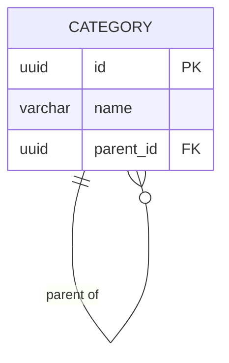
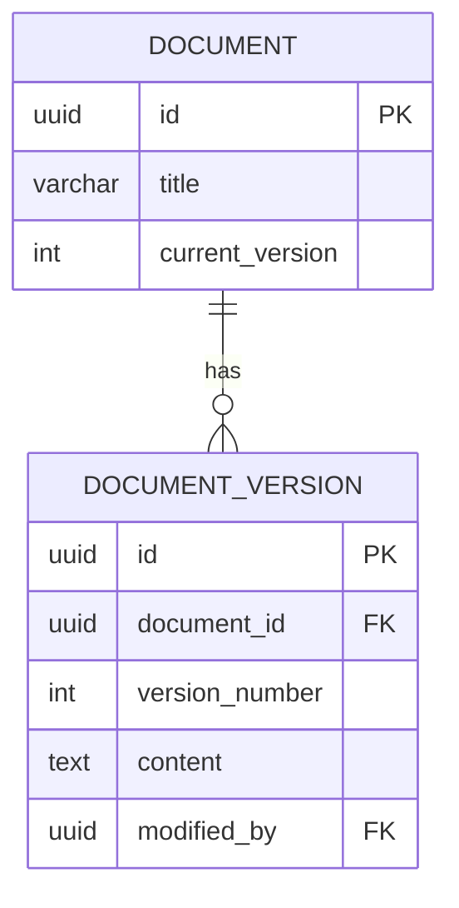

# Entity Relationship Diagrams Reference

ERDs model database schemas showing tables, columns, and relationships.

## Basic Syntax

```
erDiagram
    CUSTOMER ||--o{ ORDER : places
```

## Entity Attributes

```
erDiagram
    CUSTOMER {
        int id PK
        string email UK
        string name
        datetime created_at
    }
```

**Format:** `type name constraint`

**Constraints:**
- `PK` - Primary Key
- `FK` - Foreign Key
- `UK` - Unique Key
- `NN` - Not Null

## Relationships

| Symbol | Meaning |
|--------|---------|
| `\|\|` | Exactly one |
| `\|o` | Zero or one |
| `}{` | One or many |
| `}o` | Zero or many |
| `--` | Non-identifying |
| `..` | Identifying |

### Common Patterns

```
%% One-to-One
USER ||--|| PROFILE : has

%% One-to-Many
CUSTOMER ||--o{ ORDER : places

%% Many-to-Many
STUDENT }o--o{ COURSE : enrolls

%% Optional
EMPLOYEE |o--o{ DEPARTMENT : manages
```

## Data Types

- `int`, `bigint`, `smallint`
- `varchar`, `text`, `char`
- `decimal`, `float`, `double`
- `boolean`, `bool`
- `date`, `datetime`, `timestamp`
- `json`, `jsonb`
- `uuid`
- `blob`, `bytea`

## Common Patterns

### Self-Referencing (Hierarchical)



### Junction Table (Many-to-Many)

```mermaid
erDiagram
    STUDENT ||--o{ ENROLLMENT : has
    COURSE ||--o{ ENROLLMENT : includes

    STUDENT {
        uuid id PK
        varchar name
    }

    ENROLLMENT {
        uuid student_id FK PK
        uuid course_id FK PK
        date enrolled_date
    }

    COURSE {
        uuid id PK
        varchar title
    }
```

### Soft Deletes

```
USER {
    uuid id PK
    varchar email UK
    timestamp deleted_at
}
```

### Audit Trail



## Best Practices

1. **UPPERCASE names** - Convention for clarity
2. **Singular names** - `USER` not `USERS`
3. **Define all constraints** - PK, FK, UK, NOT NULL
4. **Accurate cardinality** - One-to-many vs many-to-many
5. **Include timestamps** - created_at, updated_at
6. **Document computed columns** - Mark calculated values
7. **Use junction tables** - Model many-to-many explicitly
8. **Show indexes** - Document unique keys beyond PKs
9. **Add comments** - Use quotes for descriptions
10. **Match database types** - Use actual DB types
