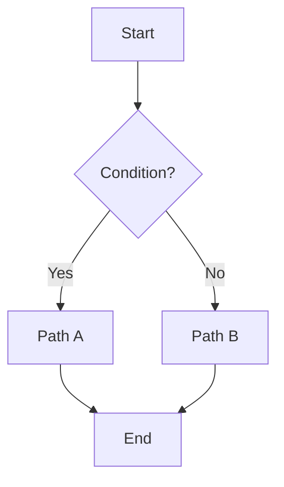
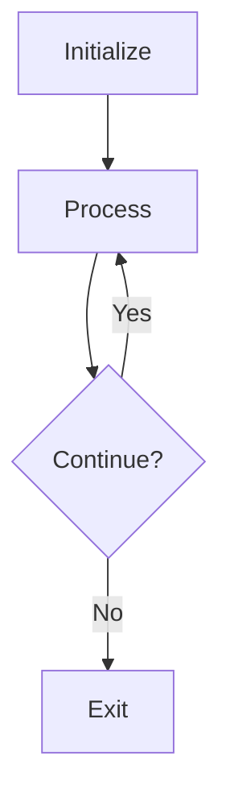
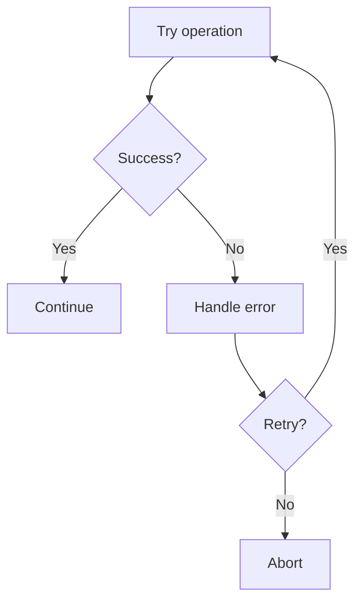
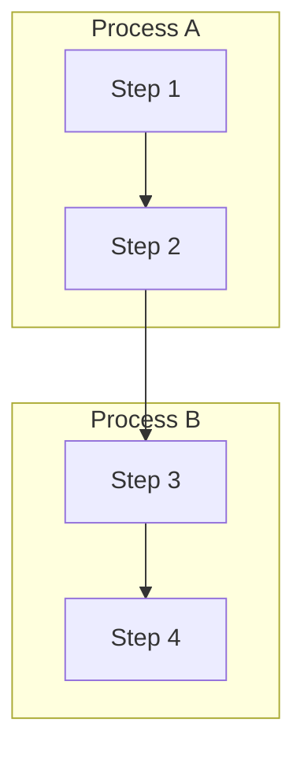

# Flowcharts Reference

Flowcharts visualize processes, algorithms, decision trees, and user journeys.

## Basic Syntax

```
flowchart TD
    A --> B
```

**Directions:** `TD`/`TB` (top-bottom), `BT` (bottom-top), `LR` (left-right), `RL` (right-left)

## Subgraphs

```
flowchart TB
    subgraph id["Display Name"]
        direction TB
        A --> B
    end
```

**Nested subgraphs:** Keep to 2 levels maximum.

**Connecting:** Reference by ID (`g1 -.-> g2`) or connect internal nodes (`A --> B`)

## Styling

```
# Inline
style A fill:#d3f9d8,stroke:#2f9e44,stroke-width:2px

# Multiple nodes
style A,B,C fill:#d3f9d8,stroke:#2f9e44

# Class-based
classDef green fill:#d3f9d8,stroke:#2f9e44
A[Node]:::green
```

## Common Patterns

### Decision Tree



### Loop Pattern



### Error Handling



### Swimlane



## Best Practices

1. **Meaningful labels** - Clear, action-oriented text
2. **Consistent shapes** - Same shape for same action types
3. **Diamond for decisions** - Standard convention
4. **Natural flow** - Top-to-bottom or left-to-right
5. **Start/end markers** - Use stadium shapes
6. **Group related steps** - Use subgraphs
7. **Color code** - Highlight different action types
8. **One process per diagram** - Keep focused
