# Mermaid Patterns Collection

Reusable diagram patterns with complete styling. Combine with [CHEATSHEET.md](CHEATSHEET.md) for syntax details.

## Flowchart Patterns

### Process with Error Handling

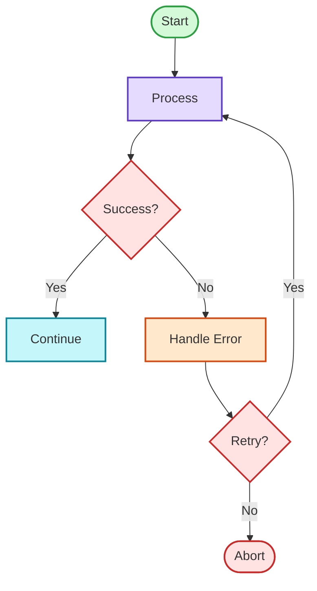

### Three-Tier Architecture

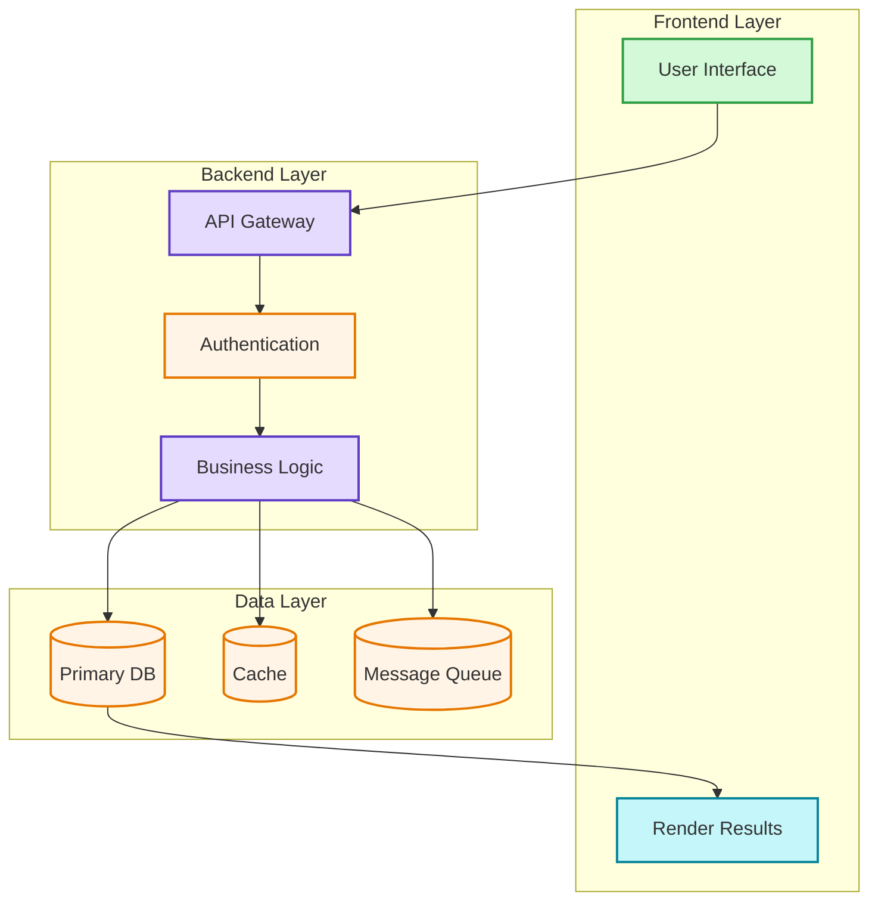

### AI Agent Workflow

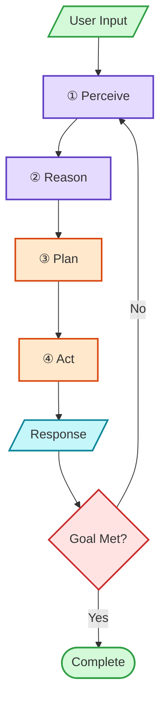

### CI/CD Pipeline

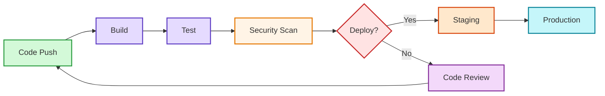

## Sequence Patterns

### Authentication Flow

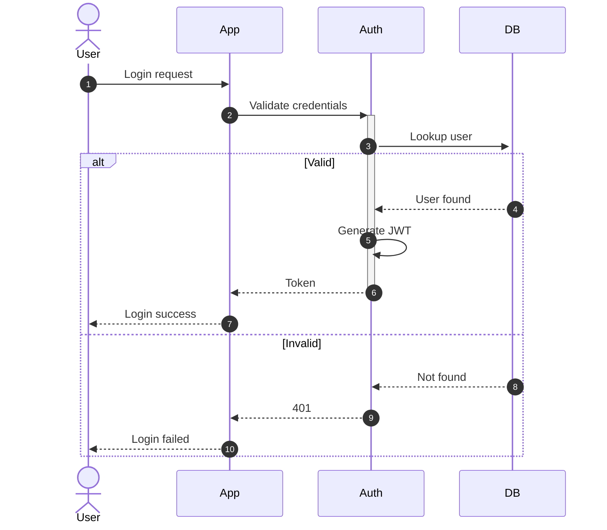

### Request with Retry

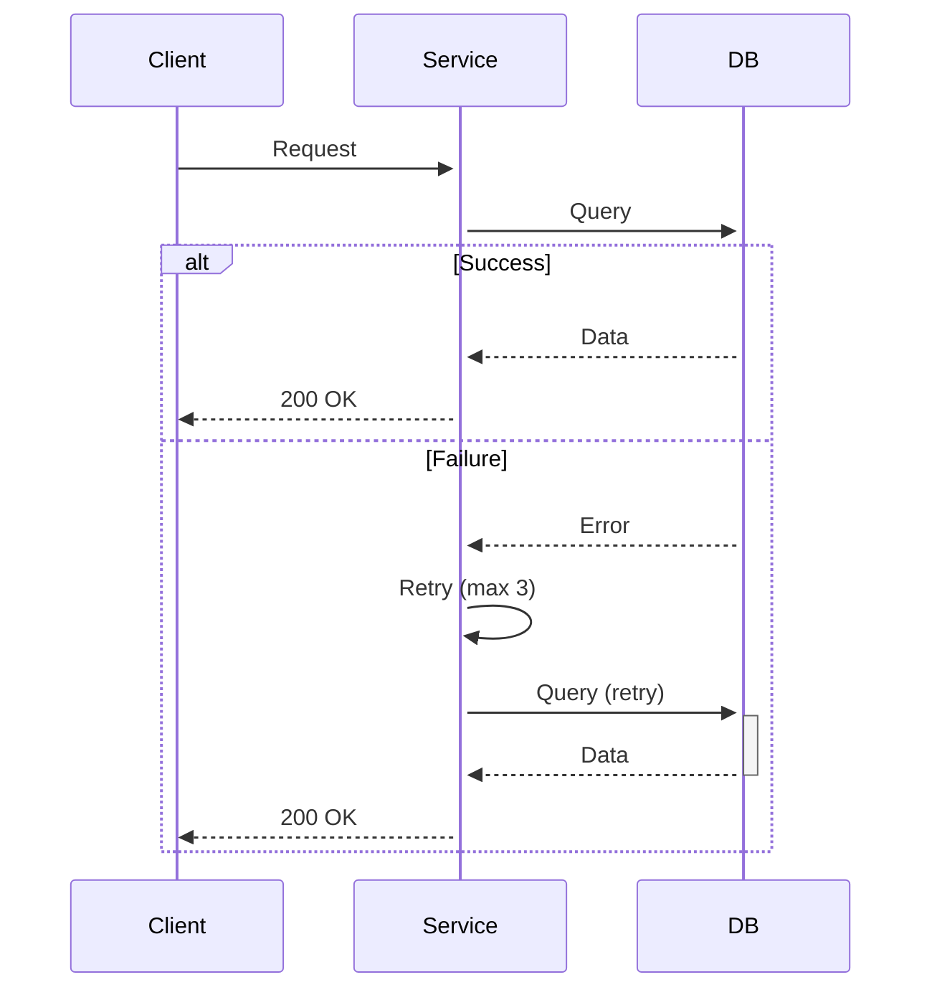

### Parallel Operations

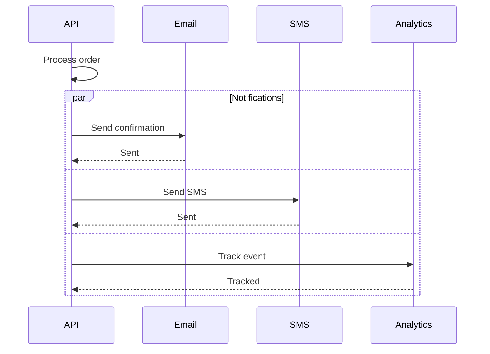

## Class Diagram Patterns

### Repository Pattern

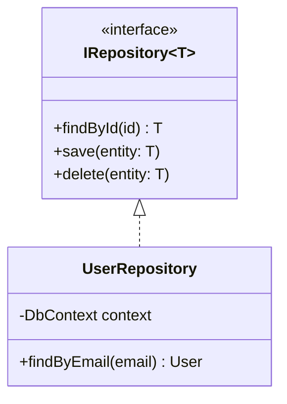

### Factory Pattern

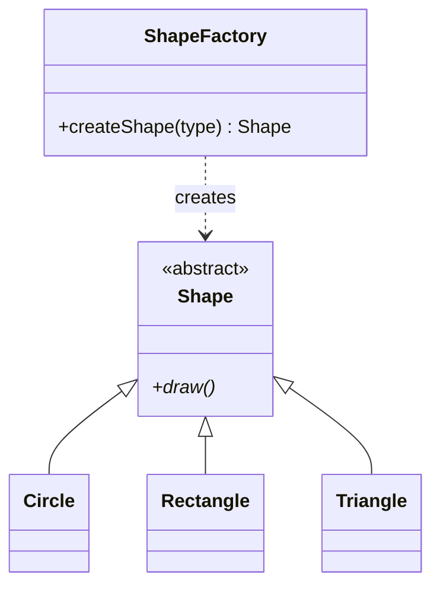

## ERD Patterns

### User-Centric Schema

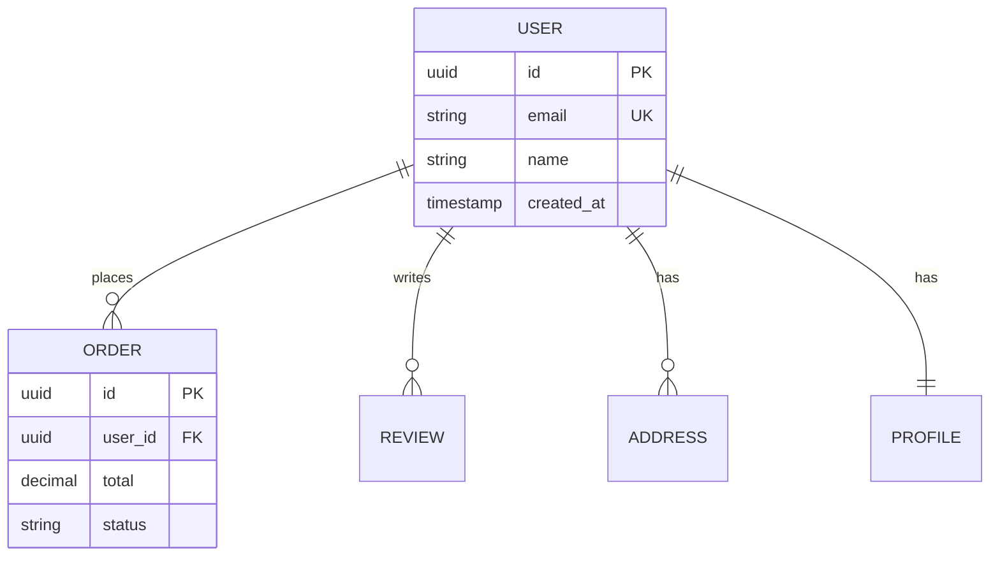

### Many-to-Many (Junction Table)

```mermaid
erDiagram
    STUDENT ||--o{ ENROLLMENT : has
    COURSE ||--o{ ENROLLMENT : includes

    STUDENT {
        uuid id PK
        varchar name
    }

    ENROLLMENT {
        uuid student_id FK PK
        uuid course_id FK PK
        date enrolled_date
        string grade
    }

    COURSE {
        uuid id PK
        varchar title
        int credits
    }
```

## Comparison Pattern

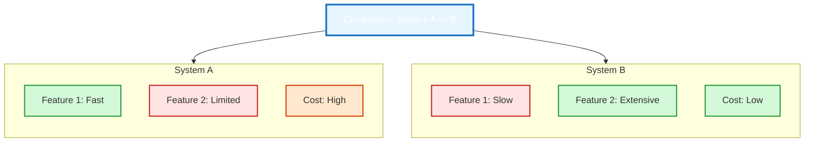

## Hub and Spoke Pattern

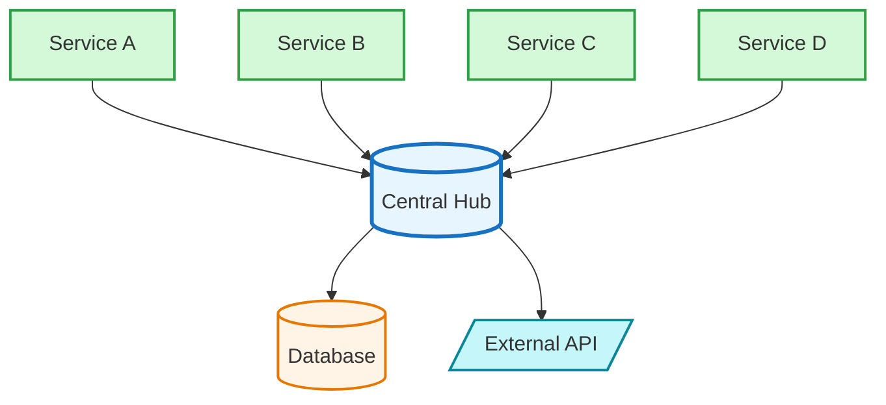

## Style Reference

```
# Semantic color mapping
Input/Start:    fill:#d3f9d8,stroke:#2f9e44  (Green)
Decision:       fill:#ffe3e3,stroke:#c92a2a  (Red)
Process:        fill:#e5dbff,stroke:#5f3dc4  (Purple)
Action:         fill:#ffe8cc,stroke:#d9480f  (Orange)
Output:         fill:#c5f6fa,stroke:#0c8599  (Cyan)
Storage:        fill:#fff4e6,stroke:#e67700  (Yellow)
Title/Hub:      fill:#e7f5ff,stroke:#1971c2  (Blue)
Learning:       fill:#f3d9fa,stroke:#862e9c  (Pink)
```
