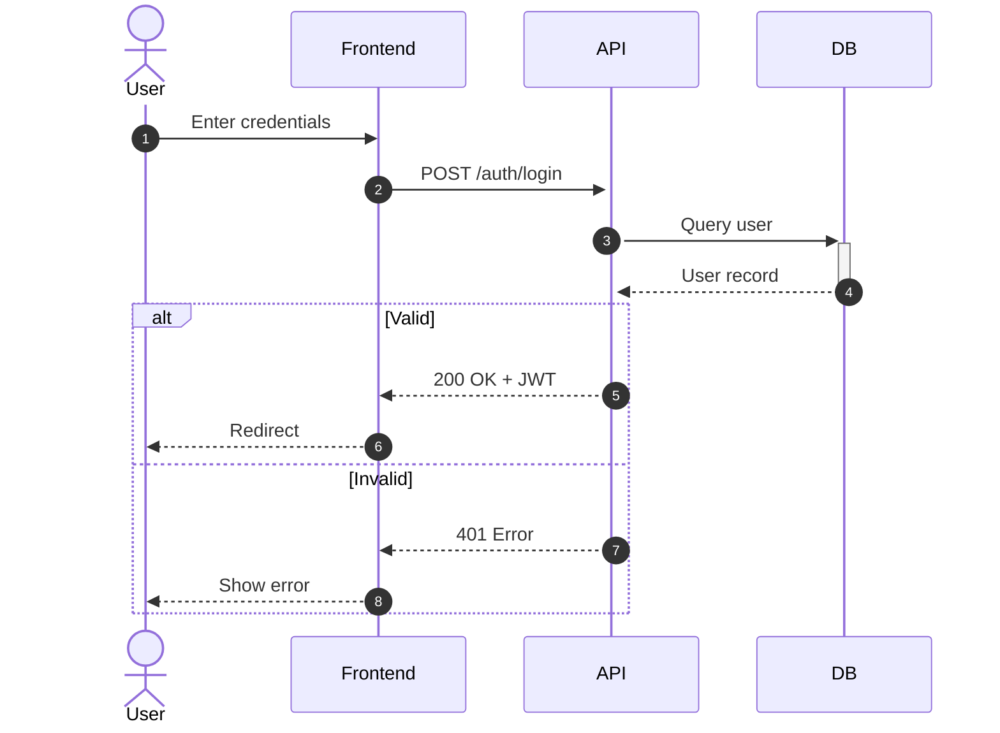
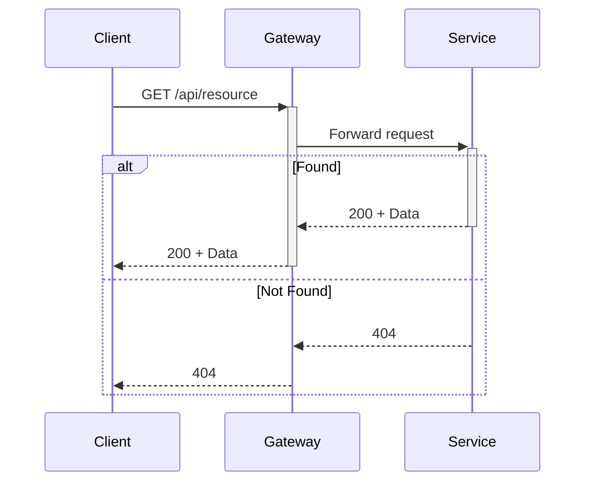

# Sequence Diagrams Reference

Sequence diagrams show interactions between participants over time. Ideal for API flows, authentication, and system interactions.

## Basic Syntax

```
sequenceDiagram
    participant A
    participant B
    A->>B: Message
```

## Participants vs Actors

```
actor User              # External entities (users, external systems)
participant API         # System components (services, databases)
```

## Message Types

| Arrow | Syntax | Meaning |
|-------|--------|---------|
| Solid | `A->>B` | Synchronous request |
| Dotted | `A-->>B` | Response/return |
| Async solid | `A-)B` | Async message |
| Async dotted | `A--)B` | Async response |
| Delete | `A-xB` | Delete participant |

## Activations

Show when a participant is actively processing:

```
Client->>+Server: Request
Server->>+Database: Query
Database-->>-Server: Data
Server-->>-Client: Response
```

- `+` after arrow = activate
- `-` before arrow = deactivate

## Control Structures

### Alt/Else (Conditional)

```
alt Valid credentials
    API-->>User: 200 OK
else Invalid credentials
    API-->>User: 401 Unauthorized
end
```

### Opt (Optional)

```
opt Payment successful
    API->>EmailService: Send confirmation
end
```

### Par (Parallel)

```
par Send email
    Service->>EmailService: Send
and Update inventory
    Service->>InventoryService: Update
end
```

### Loop

```
loop For each item
    Server->>Database: Process item
end
```

### Break (Early Exit)

```
break Input invalid
    API-->>User: 400 Bad Request
end
```

## Notes

```
Note over API: Processing request
Note over Frontend,API: HTTPS encrypted
Note right of System: Logs to DB
Note left of User: Updates UI
```

## Sequence Numbers

```
sequenceDiagram
    autonumber
    User->>API: Request
    API->>DB: Query
```

## Common Patterns

### Authentication Flow



### API Request/Response



## Best Practices

1. **Logical ordering** - User → Frontend → Backend → Database
2. **Use activations** - Show active processing
3. **Group logic** - Use alt/opt/par for conditionals
4. **Add notes** - Explain complex logic
5. **One scenario per diagram** - Keep focused
6. **Number messages** - For complex flows
7. **Show error paths** - Document failures
8. **Mark async** - Use open arrows for fire-and-forget
