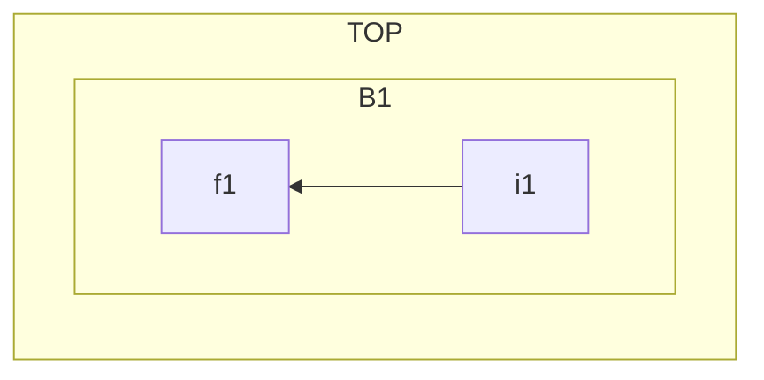
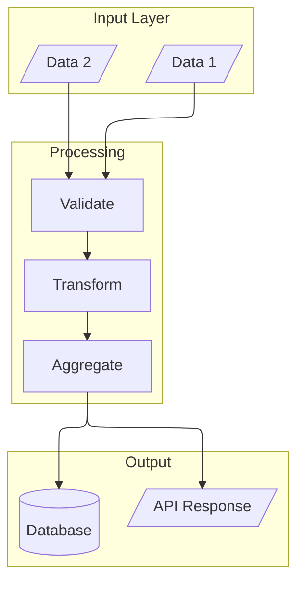
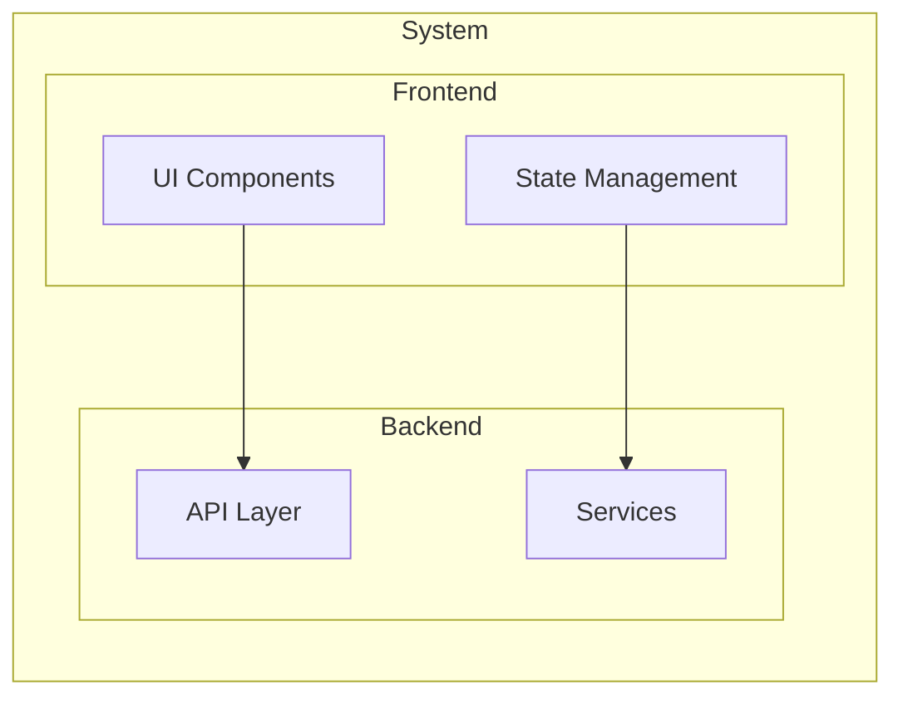

# Layout Control Guide

Advanced layout configuration for complex diagrams.

## Layout Engines

### dagre (Default)

- Standard hierarchical layout
- Fast, predictable results
- Use for: simple flowcharts, org charts

### ELK (Eclipse Layout Kernel)

- Sophisticated algorithms for complex graphs
- Better node spacing and edge routing
- Requires Mermaid 9.4+

#### ELK Algorithms

| Algorithm | Config | Best For |
|-----------|--------|----------|
| elk.layered | `layout: elk` | Hierarchical (default) |
| elk.stress | `layout: elk.stress` | Network graphs, stress minimization |
| elk.force | `layout: elk.force` | Force-directed |
| elk.mrtree | `layout: elk.mrtree` | Multi-root trees |

#### ELK Configuration

```yaml
---
config:
  layout: elk
  elk:
    mergeEdges: true
    nodePlacementStrategy: LINEAR_SEGMENTS
---
```

**nodePlacementStrategy options:**
- `BRANDES_KOEPF` (default) - Balanced
- `LINEAR_SEGMENTS` - Compact
- `NETWORK_SIMPLEX` - Optimized edge lengths
- `SIMPLE` - Fastest

## Subgraph Direction

Each subgraph can have independent direction:



**Common patterns:**
- Vertical main + horizontal subgroups: `flowchart TB` + `direction LR`
- Timeline with details: `flowchart LR` + `direction TB`

## Spacing Control

Fine-tune diagram spacing:

```yaml
---
config:
  flowchart:
    nodeSpacing: 10
    rankSpacing: 50
---
```

## Decision Matrix

| Diagram Type | Engine | Main Dir | Subgraph Dir |
|--------------|--------|----------|--------------|
| Simple Process | default | TD | - |
| Complex Architecture | elk | TB | LR |
| Timeline | default | LR | TB |
| Network Graph | elk.stress | TB | - |
| Org Chart | default | TD | - |
| Multi-root Tree | elk.mrtree | TB | - |

## Examples

### Complex Architecture with ELK



### Nested Subgraphs with Independent Directions


